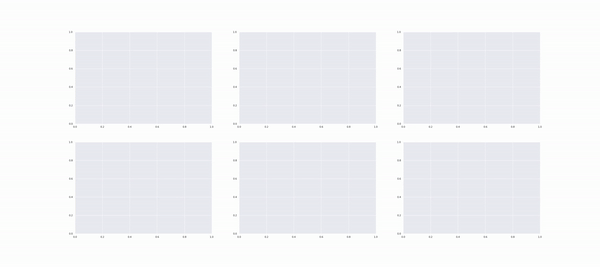
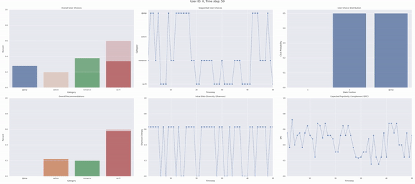

# gym-recsys: Customizable RecSys Simulator for OpenAI Gym

**[Installation](#Installation)** |
**[How to use](#How-to-use)** | **[Examples](#Examples)** | **[Citation](#Citation)**

This package describes an OpenAI Gym interface for creating a simulation environment of reinforcement learning-based recommender systems (RL-RecSys). The design strives for simple and flexible APIs to support novel research. 

## Installation

`gym-recsys` can be installed from PyPI using `pip`:

```bash
pip install gym-recsys
```

Note that we support Python 3.7+ only.

You can also install it directly from this GitHub repository using `pip`:

```bash
pip install git+git://github.com/zuoxingdong/gym-recsys.git
```

## How to use

To use `gym-recsys`, you need to define the following components:

#### `user_ids`

This describes a list of available user IDs for the simulation. Normally, a user ID is an integer. 

An example of three users: `user_ids = [0, 1, 2]`

Note that the user ID will be taken as an input to `user_state_model_callback` to generate observations of the user state. 

#### `item_category`

This describes the categories of a list of available items. The data type should be a list of strings. The indices of the list is assumed to correspond to item IDs. 

An example of three items: `item_category = ['sci-fi', 'romance', 'sci-fi']`

The category information is mainly used for visualization via `env.render()`.

#### `item_popularity`

This describe the popularity measure of a list of available items. The data type should be a list (or 1-dim array) of integers. The indices of the list is assumed to correspond to item IDs. 

An example of three items: `item_popularity = [5, 3, 1]`

The popularity information is used for calculating Expected Popularity Complement (EPC) in the visualization. 

#### `hist_seq_len`

This is an integer describing the number of most recently clicked items by the user to encode as the current state of the user. 

An example of the historical sequence with length 3: `hist_seq = [-1, 2, 0]`. The item ID `-1` indicates an empty event. In this case, the user clicked two items in the past, first item ID 2 followed by a second item ID 0. 

The internal FIFO queue `hist_seq` will be taken as an input to both `user_state_model_callback` and `reward_model_callback` to generate observations of the user state. 

#### `slate_size`

This is an integer describing the size of the slate (display list of recommended items). 

It induces a combinatorial action space for the RL agent.

#### `user_state_model_callback`

This is a Python callback function taking `user_id` and `hist_seq` as inputs to generate an observation of current user state. 

Note that it is generic. Either pre-defined heuristic computations or pre-trained neural network models using user/item embeddings can be wrapped as a callback function. 

#### `reward_model_callback`

This is a Python callback function taking `user_id`, `hist_seq` and `action` as inputs to generate a reward value for each item in the slate. (i.e. `action`)

Note that it is generic. Either pre-defined heuristic computations or pre-trained neural network models using user/item embeddings can be wrapped as a callback function. 

## Examples

To illustrate the simple yet flexible design of `gym-recsys`, we provide a toy example to construct a simulation environment. 

First, let us sample random embeddings for one user and five items:

```python
user_features = np.random.randn(1, 10)
item_features = np.random.randn(5, 10)
```

Now let us define the category and popularity score for each item:

```python
item_category = ['sci-fi', 'romance', 'sci-fi', 'action', 'sci-fi']
item_popularity = [5, 3, 1, 2, 3]
```

Then, we define callback functions for user state and reward values:

```python
def user_state_model_callback(user_id, hist_seq):
    return user_features[user_id]

def reward_model_callback(user_id, hist_seq, action):
    return np.inner(user_features[user_id], item_features[action])
```

Finally, we are ready to create a simulation environment with OpenAI Gym API:

```python
env_kws = dict(
    user_ids=[0],
    item_category=item_category,
    item_popularity=item_popularity,
    hist_seq_len=3,
    slate_size=2,
    user_state_model_callback=user_state_model_callback,
    reward_model_callback=reward_model_callback
)
env = gym.make('gym_recsys:RecSys-t50-v0', **env_kws)
```

Note that we created the environment with slate size of two items and historical interactions of the recent 3 steps. The horizon is 50 time steps. 

Now let us play with this environment. 

By evaluating a random agent with 100 times, we got the following performance:

| Agent | Episode Reward | CTR |
| :---: | :---: | :---: |
| `random` | 73.54 | 68.23% |

Given the sampled embeddings, let's say item 1 and 3 lead to maximally possible reward values. Let us see how a greedy policy performs by constantly recommending item 1 and 3:

| Agent | Episode Reward | CTR |
| :---: | :---: | :---: |
| `greedy` | 180.86 | 97.93% |

Last but not least, for the most fun part, let us generate animations of both policy for an episode via gym's `RecordVideo` wrapper, showing as GIFs in the following:

#### Random Agent



#### Greedy Agent



## Citation

If you use gym-recsys in your work, please cite this repository:

```bibtex
@software{zuo2021recsys,
  author={Zuo, Xingdong},
  title={gym-recsys: Customizable RecSys Simulator for OpenAI Gym},
  url={https://github.com/zuoxingdong/gym-recsys},
  year={2021}
}
```
